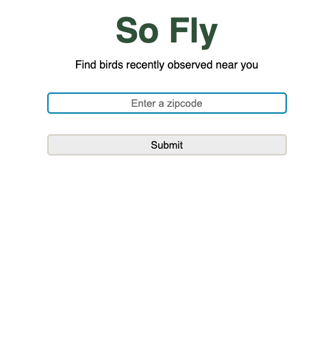
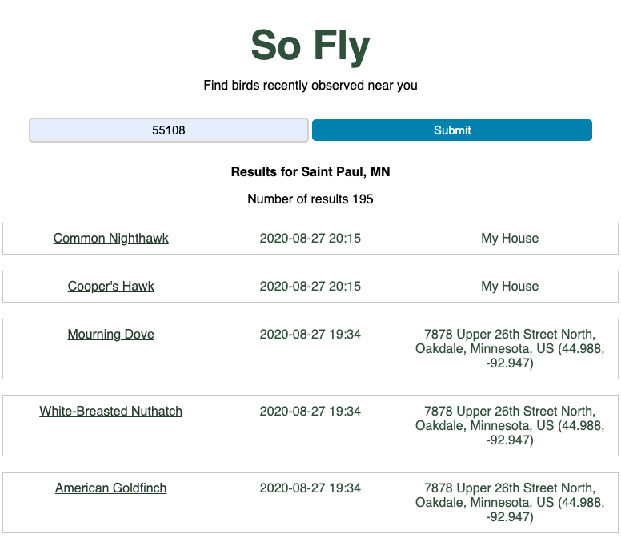
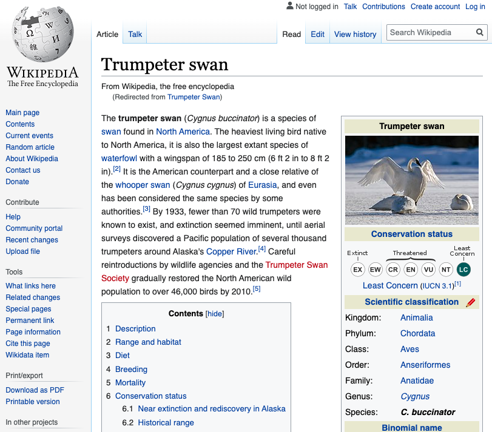

# So Fly

So Fly is an add that allows user's to search for recently seen and recorded birds in the area of the zip sode entered. The results will include name of bird, date and time seen, and where. When the bird's name is clicked, you will be redirected to a wikipedia page about that specific bird.

[Link to So Fly](kossanr.github.io/api_capstone/)

# # Technologies used

- HTML
- CSS
- JavaScript
